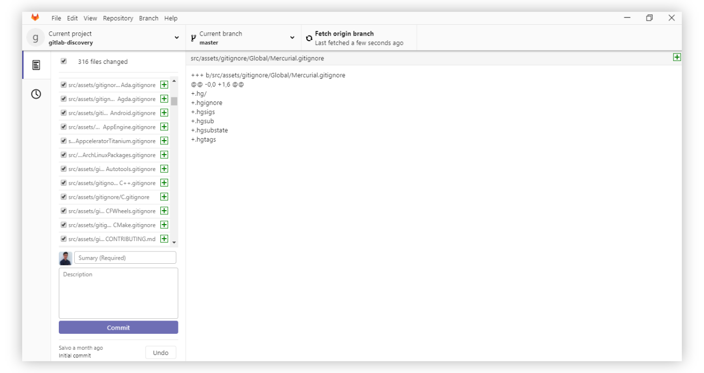

# GitLab Discovery
<p>
GitLab Discovery is a standalone and continuous development app for GitLab built with [Electron](https://electron.atom.io/), [Vue.js](https://github.com/vuejs/vue/) and [NUIverse](https://gitlab.com/nuinalp/nuiverse) and licensed by the BSD 3-clause license. We aim to create an amazing cross-platform desktop client to facilitate development and collaboration with GitLab services.
<p>

<p>
  <a href="https://www.patreon.com/nuinalp" target="_blank">
    
  </a>
</p>



# Introduction

<p>
We developed this app initially to make our team work easier, but we thought it would be cool to share with the community and everyone who works with GitLab. We strive to create an interface as close as possible to the design language created by GitLab by adapting our NUIverse framework.
</p>
## Where do I get this?

<p>For now GitLab Discovery is not yet ready to be used by other people, however you can download the source code and compile yourself, initially it was project only to work in Windows.</p>

<strong>Note: To use the Direct Source App you need to do the following:</strong>

1- Create an access [token](https://gitlab.com/profile/personal_access_tokens) at with all scopes <br>
2- Create config.js in src /
``` 
export default{ 
  username: 'your_username', 
  token: 'Your_token', 
  name_user_with_space: 'Your_name' 
} 
```

3- Create projects file in src /
``` 
{"lastProject":[],"projects":[]} 
```
4 - npm install and npm run serve: electron

# License

[BSD Clause 3](LICENSE.md)

Copyright (c) 2018 The Nuinalp Authors. All rights reserved.<br>
Use of this source code is governed by a BSD-style license that can be found in the LICENSE file.